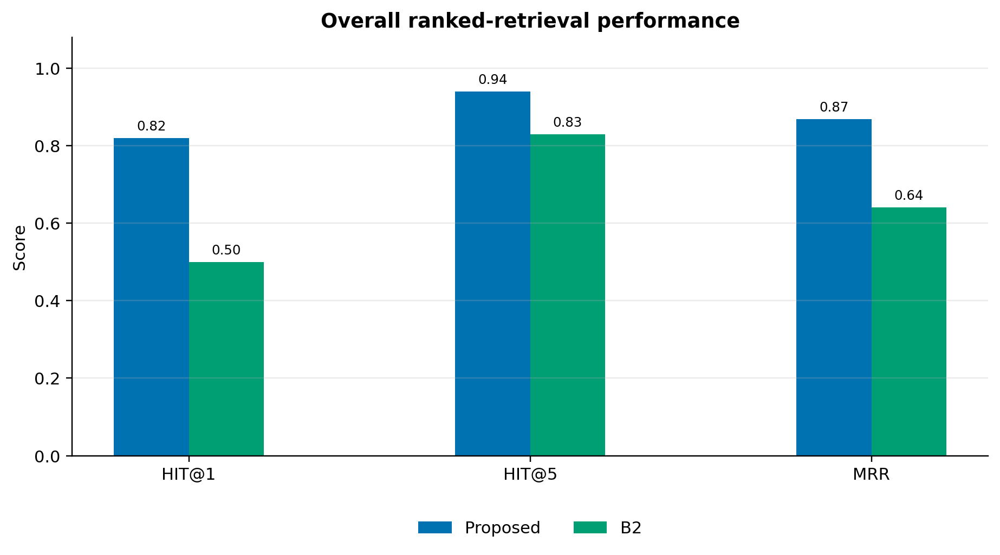
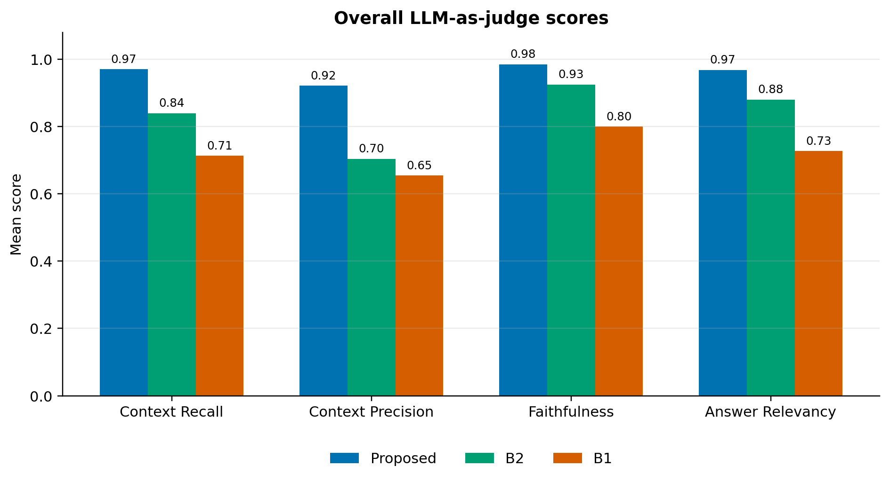
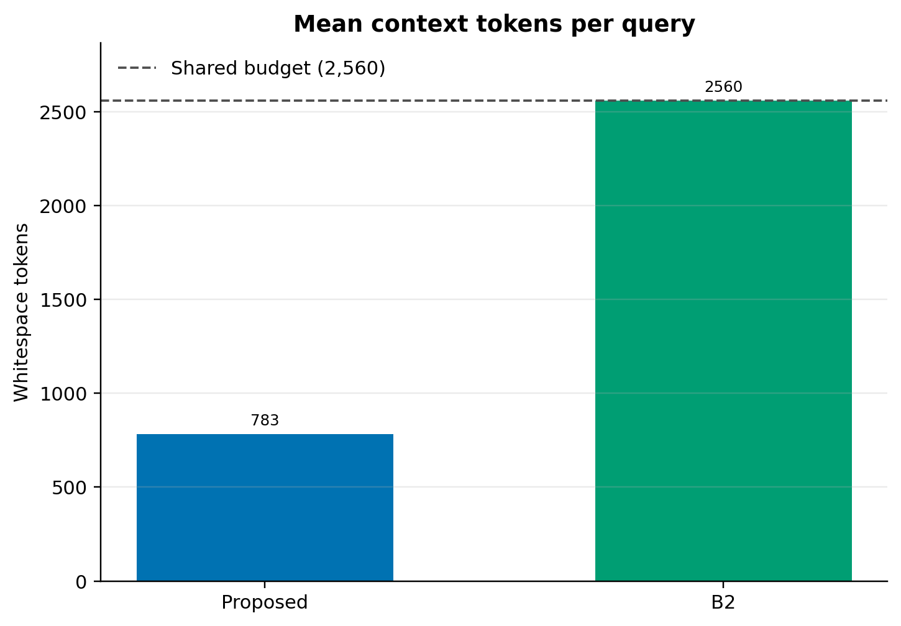
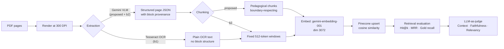
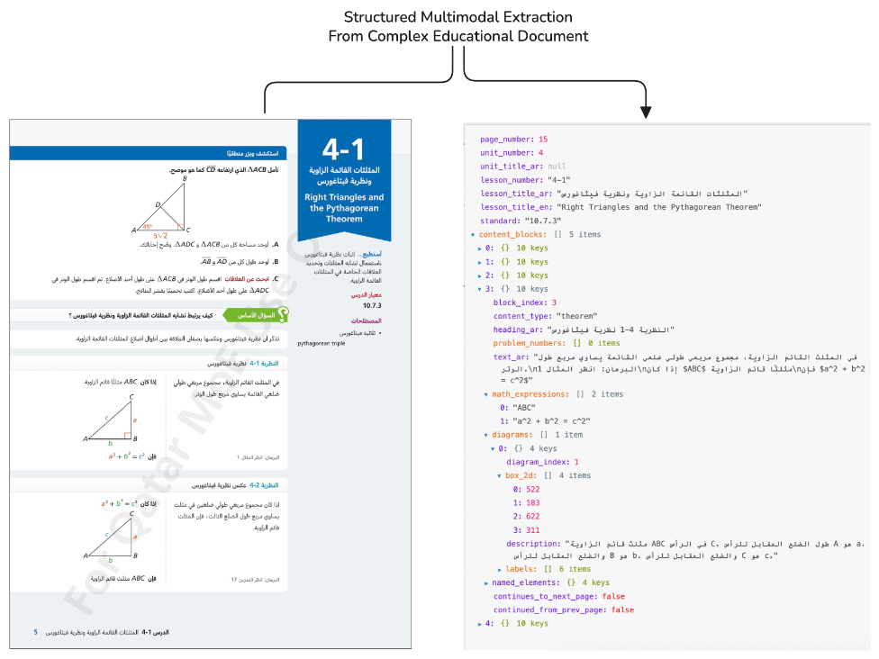

# Structured Multimodal Extraction from Complex Educational Documents for Pedagogical Chunking in Retrieval-Augmented Generation

Retrieval-augmented generation over educational textbooks depends on the quality of document preprocessing before indexing. This is particularly difficult for Arabic mathematics textbooks, where scanned pages combine right-to-left prose, mathematical notation, diagrams, and visually defined instructional units: standard OCR followed by fixed-size chunking can garble formulas, omit diagrams, and split theorems or worked examples across retrieval units.

A structured multimodal extraction and pedagogical chunking pipeline is proposed for Arabic secondary mathematics textbooks. A vision-language model (VLM) extracts textbook pages into validated JSON containing Arabic text, formulas, diagram descriptions, curriculum metadata, content types, and continuation flags. A cross-page merge algorithm then assembles this output into complete pedagogical chunks corresponding to instructional units such as definitions, theorems, worked examples, and exercises. The pipeline is evaluated on a Grade 10 Qatari mathematics textbook using controlled baselines that isolate extraction quality from chunking strategy.

Holding extraction and embedding representation constant, pedagogical-unit chunking improves Hit@1 from 0.50 to 0.82, Hit@5 from 0.83 to 0.94, and MRR from 0.641 to 0.869 over fixed-window chunking across 100 evaluation questions, while cutting mean retrieved context from 2,560 to 783 tokens. Gains are largest for formula-retrieval questions (Hit@1: 0.15 to 0.85) and diagram-dependent questions (Hit@1: 0.55 to 0.90).

---

## Systems

Three systems are compared:

| System       | Extraction                         | Chunking                       | Pinecone Index                   | Gold Granularity   |
| ------------ | ---------------------------------- | ------------------------------ | -------------------------------- | ------------------ |
| **proposed** | Gemini VLM (structured JSON)       | Pedagogical, block-aware merge | `curriculum-highschool-proposed` | Source-block unit  |
| **b2**       | Gemini VLM (identical to proposed) | Fixed 512-token windows        | `curriculum-highschool-b2`       | Source-block unit  |
| **b1**       | Tesseract OCR                      | Fixed 512-token windows        | `curriculum-highschool-b1`       | Page-overlap proxy |

The **proposed vs. b2** comparison is the key experiment: same extraction backend, same embedding model, same vector database, differing only in chunk boundaries. This isolates chunking strategy from all other variables. B1 additionally varies the extraction layer (OCR instead of VLM) and lacks block provenance, so its gold signal is a page-overlap proxy rather than unit-level ground truth.

---

## Results

### Retrieval Metrics (100-question frozen QA dataset)

| Metric               |    proposed |                b2 |
| -------------------- | ----------: | ----------------: |
| **Hit@1**            |    **0.82** |              0.50 |
| **Hit@5**            |    **0.94** |              0.83 |
| **MRR**              |   **0.869** |             0.641 |
| **Gold-unit recall** |    **0.94** |              0.83 |
| Mean context tokens  |     **783** | 2,560 (truncated) |
| Contexts truncated   | **0 / 100** |         100 / 100 |
| Corpus chunks        |         840 |               205 |

Pedagogical chunks are more targeted: the proposed system retrieves the correct unit with a mean of 783 tokens of context versus 2,560 fully-truncated tokens for b2, and never truncates.



### Gains by Question Type

The improvement is largest for content categories that fixed-window chunking is most likely to fracture:

| Question Type              | proposed Hit@1 | b2 Hit@1 |     Delta |
| -------------------------- | -------------: | -------: | --------: |
| `formula_retrieval`        |           0.85 |     0.15 | **+0.70** |
| `diagram_dependent`        |           0.90 |     0.55 | **+0.35** |
| `theorem_statement`        |           1.00 |     1.00 |      0.00 |
| `worked_example_reasoning` |           1.00 |       -- |        -- |

Fixed windows consistently separate a formula or diagram from its surrounding instructional context, rendering those questions effectively unretrievable.

### LLM-as-Judge Scores (secondary, corroborating evidence)

Judge evaluation uses a RAGAS-inspired protocol. The judge receives only the question, retrieved context, and generated answer; it never sees gold chunk IDs or retrieval ranks.

| Dimension         |  proposed |    b2 | Delta (paired) | 95% Bootstrap CI |
| ----------------- | --------: | ----: | -------------: | ---------------- |
| Context recall    | **0.970** | 0.849 |     **+0.120** | [0.047, 0.203]   |
| Context precision | **0.918** | 0.708 |     **+0.209** | [0.128, 0.292]   |
| Faithfulness      | **0.980** | 0.930 |     **+0.050** | --               |
| Answer relevancy  | **0.978** | 0.879 |     **+0.099** | [0.039, 0.169]   |

All confidence intervals exclude zero. The proposed system leads on every dimension, including faithfulness, where higher retrieval precision reduces the volume of irrelevant context that could distort generated answers.



### Retrieved Context Efficiency

The proposed system reduced mean retrieved context from 2,560 to 782.9 tokens. Pedagogical chunks are naturally shorter and more variable in length -- a short definition versus a longer worked example -- so retrieval returns exactly the amount of text the question requires rather than padding to a fixed budget. This is a meaningful secondary finding: better chunking does not only improve accuracy, it also reduces the token cost passed to the generator, which has direct implications for both inference cost and hallucination risk downstream.



---

## Pipeline Architecture



The pipeline has a single branching point after rendering. Proposed and b2 share the entire extraction layer and embedding representation; they diverge only at the chunking stage.

### Stage-by-Stage Breakdown

**Stage 1 -- Render** (`ragkit/render.py`): PyMuPDF renders every page to PNG at 300 DPI, sufficient for both Gemini vision and Tesseract OCR.

**Stage 2 -- Extract** (`ragkit/extract/`):

- _Gemini path_ (`gemini.py`): A structured extraction prompt instructs the VLM to output a validated JSON object per page. Each block carries `content_type`, Arabic heading, main text, `math_expressions[]`, `diagrams[]`, named elements (theorems, definitions, vocabulary, standards), and cross-page continuation flags (`continues_to_next_page`, `continued_from_prev_page`). Diagram regions are cropped with 12 px padding and uploaded to Cloudinary; bounding-box coordinates are normalised to 0--1. VLM extraction reduces character error rate from 45.91% to 0.03% relative to Tesseract OCR.
- _Tesseract path_ (`tesseract.py`): Plain OCR text per page, Arabic language data (`ocr_lang="ara"`). No block structure or provenance.



**Stage 3 -- Represent** (`ragkit/represent.py`): Embedding text is assembled with explicit Arabic prefixes so the semantic structure is machine-readable:

```
الوحدة: <unit title>
الدرس: <lesson title (Arabic)>
Lesson: <lesson title (English)>
<block heading>
<main Arabic text>
المعادلة: <math expression>     (one line per expression)
شكل هندسي: <diagram description>. التسميات: <labels>
```

**Stage 4 -- Chunk** (`ragkit/chunk/`):

- _Pedagogical_ (`pedagogical.py`): Each extracted content block is treated as an instructional unit. Blocks flagged `continues_to_next_page` are merged with the matching block on the next page, extending the chunk's `page_range` and attaching diagram URLs. Open chunks are tracked by `(lesson_number, content_type, heading_ar)`. Chunk IDs encode full provenance: `s<semester>-u<unit>-l<lesson>-<type>-p<page>-b<block>`.
- _Fixed window_ (`fixed.py`): Sliding window of 512 tokens, 50-token overlap (stride 462). B2 carries per-token source-block provenance so coverage fractions can be computed at evaluation time.

**Stage 5 -- Embed** (`ragkit/embed.py`): `gemini-embedding-001`, dim 3072, `RETRIEVAL_QUERY` task type, via Vertex AI.

**Stage 6 -- Index** (`ragkit/index.py`): Pinecone cosine index (AWS `us-east-1`, dim 3072), upserted in batches of 100. Each system uses an isolated index so results do not collide.

---

## Repository Layout

```
pedagogical-chunking-rag/
├── ragkit/                     # Reusable pipeline library
│   ├── config.py               # Every tunable knob as frozen dataclasses
│   ├── pipeline.py             # Orchestrator: render -> extract -> chunk -> embed -> upsert
│   ├── render.py               # PDF -> PNG (PyMuPDF, 300 DPI)
│   ├── represent.py            # Chunk -> Arabic-prefixed embedding text
│   ├── embed.py                # gemini-embedding-001 embedding
│   ├── index.py                # Pinecone index creation and upsert
│   ├── cache.py                # Cache layout, JSONL/JSON helpers
│   ├── chunk/
│   │   ├── pedagogical.py      # Block-aware pedagogical chunker (proposed)
│   │   └── fixed.py            # Fixed-token-window chunker (b1, b2)
│   ├── extract/
│   │   ├── gemini.py           # Gemini structured extraction + diagram crop/upload
│   │   └── tesseract.py        # Tesseract OCR baseline
│   ├── qa/                     # QA dataset construction pipeline
│   │   ├── source_selection.py # Stage 1 -- eligible chunk selection
│   │   ├── generation.py       # Stage 2 -- LLM candidate generation
│   │   ├── validation.py       # Stage 3 -- rule-based validation (11 rules)
│   │   ├── finalize.py         # Stage 4 -- freeze the dataset
│   │   ├── gold_mapping.py     # Map gold answers to chunk IDs per system
│   │   ├── prompts.py          # QA generation prompts
│   │   ├── normalize.py        # Arabic text normalisation
│   │   └── runner.py           # CLI orchestrator
│   ├── retrieval/              # Retrieval evaluation subsystem
│   │   ├── engine.py           # Pinecone and local retrievers
│   │   ├── corpus.py           # Gold target assembly per question
│   │   ├── metrics.py          # Hit@k, MRR, gold recall
│   │   ├── answer.py           # Context assembly + answer generation
│   │   ├── report.py           # Summaries + comparison markdown
│   │   └── runner.py           # Retrieval CLI orchestrator
│   └── judge/                  # LLM-as-judge (RAGAS-inspired)
│       ├── client.py           # vertex_gemini / vertex_anthropic / mock clients
│       ├── corpus.py           # Frozen-input reconstruction and verification
│       ├── scoring.py          # Per-dimension scoring with bounded retries
│       ├── metrics.py          # Aggregation, paired bootstrap CI
│       ├── prompts.py          # Judge system and user prompts
│       ├── parser.py           # JSON score extraction from judge replies
│       ├── report.py           # Per-system and cross-system reports
│       └── runner.py           # Resumable judge CLI orchestrator
│
├── experiments/                # Entry points and report generators
│   ├── proposed.py             # Proposed pipeline entry point
│   ├── b1.py                   # OCR baseline entry point
│   ├── b2.py                   # Fixed-window baseline entry point
│   ├── qa_dataset.py           # QA dataset CLI
│   ├── retrieval_proposed.py / retrieval_b1.py / retrieval_b2.py
│   ├── retrieval_results_report.py
│   ├── judge.py                # All-systems judge CLI
│   ├── judge_proposed.py / judge_b1.py / judge_b2.py
│   └── judge_results_report.py
│
├── extraction_experiments/     # Extraction accuracy spot-checks
│   ├── CER.py                  # Character error rate: Tesseract vs. Gemini
│   ├── Random_Blocks_Sample.py # Random block sample -> CSV
│   ├── random_diagrams_sample.py
│   └── random_formula_sample.py
│
├── qa_dataset/                 # Frozen QA dataset artifacts (100 questions)
├── retrieval_eval/             # Retrieval evaluation artifacts and analysis
├── judge_eval/                 # Judge run outputs and analysis
├── cache/                      # Proposed pipeline cache (840 chunks)
├── cache_b2/                   # B2 cache (205 chunks)
├── cache_b1/                   # B1 cache (115 chunks)
├── requirements.txt
└── .env.example
```

---

## Setup

### Requirements

- Python 3.10+
- Tesseract OCR with Arabic language data (`ara`) -- required only for the B1 baseline
- Google Cloud / Vertex AI credentials (Gemini extraction, embeddings, QA generation, judge)
- Pinecone API access
- Cloudinary credentials (diagram upload, used by proposed and b2; skippable with `--skip-bbox`)

### Install

**macOS** (Tesseract):

```bash
brew install tesseract tesseract-lang
```

**Python environment:**

```bash
python -m venv .venv
source .venv/bin/activate
pip install -r requirements.txt
```

Key pinned dependencies: `pymupdf==1.24.10`, `google-genai==0.3.0`, `pinecone==5.3.1`, `pydantic==2.9.2`, `python-dotenv==1.0.1`, `tqdm==4.66.5`, `pillow==10.4.0`, `cloudinary==1.41.0`, `matplotlib==3.9.2`, `pytesseract==0.3.13`.

### Environment Variables

Copy `.env.example` to `.env`. Nothing is hard-coded.

| Variable                         | Purpose                               | Default                    |
| -------------------------------- | ------------------------------------- | -------------------------- |
| `GOOGLE_APPLICATION_CREDENTIALS` | GCP service-account key for Vertex AI | --                         |
| `GOOGLE_CLOUD_PROJECT`           | GCP project ID                        | --                         |
| `GOOGLE_CLOUD_LOCATION`          | Vertex AI region                      | `us-central1`              |
| `PINECONE_API_KEY`               | Pinecone API key                      | --                         |
| `PINECONE_INDEX_NAME`            | Proposed system index                 | `curriculum-highschool`    |
| `PINECONE_INDEX_NAME_B1`         | B1 index                              | `curriculum-highschool-b1` |
| `PINECONE_INDEX_NAME_B2`         | B2 index                              | `curriculum-highschool-b2` |
| `CLOUDINARY_CLOUD_NAME`          | Cloudinary account                    | --                         |
| `CLOUDINARY_API_KEY`             | Cloudinary API key                    | --                         |
| `CLOUDINARY_API_SECRET`          | Cloudinary secret                     | --                         |
| `QA_GENERATION_MODEL`            | QA candidate generation model         | `gemini-3.1-pro-preview`   |
| `RETRIEVAL_ANSWER_MODEL`         | Answer generation model               | `gemini-3.1-pro-preview`   |
| `JUDGE_MODEL`                    | LLM judge model                       | `gemini-3.1-pro-preview`   |

Cloudinary is optional when `--skip-bbox` is passed to any Gemini pipeline run.

---

## Running the Pipelines

### Core CLI flags (all experiments)

| Flag                                        | Effect                                                                                           |
| ------------------------------------------- | ------------------------------------------------------------------------------------------------ |
| `--pdf`                                     | Path to the input PDF (required)                                                                 |
| `--semester {1,2}`                          | Semester number (required)                                                                       |
| `--cache-dir`                               | Output cache directory                                                                           |
| `--start-page`, `--end-page`, `--max-pages` | Page range                                                                                       |
| `--stop-after-texts`                        | Stop after writing `chunks.json` and `embedding_texts.jsonl`; skip embedding and Pinecone upsert |
| `--embed-only`                              | Skip render/extract/chunk; load cached artifacts and run embedding and upsert                    |
| `--provenance-only`                         | Rebuild chunks and provenance files from cached extractions; no Gemini calls, no vector writes   |

Gemini-pipeline flags (proposed and b2):

| Flag           | Effect                                                      |
| -------------- | ----------------------------------------------------------- |
| `--skip-bbox`  | Skip diagram cropping and Cloudinary upload                 |
| `--chunk-only` | Start from cached extractions; skip render and Gemini calls |

### 1. Build extraction and chunk caches

```bash
# Full proposed pipeline (pages 15-236 of a Semester 2 PDF)
python -m experiments.proposed --pdf textbook-s2.pdf --semester 2 --start-page 15 --end-page 236

# OCR baseline
python -m experiments.b1 --pdf textbook-s2.pdf --semester 2 --start-page 15 --end-page 236

# Fixed-window baseline (reuses proposed's Gemini extractions automatically)
python -m experiments.b2 --pdf textbook-s2.pdf --semester 2 --start-page 15 --end-page 236

# Rebuild chunks and provenance from cached extractions (no Gemini API calls)
python -m experiments.b2 --pdf textbook-s2.pdf --semester 2 --provenance-only
```

The pipeline reuses matching upstream artifacts from sibling caches when the same PDF and semester has already been processed.

### 2. Build the QA dataset

The QA CLI runs five sequential stages:

```bash
python -m experiments.qa_dataset select    # Select eligible source chunks
python -m experiments.qa_dataset generate  # Generate question/answer candidates via LLM
python -m experiments.qa_dataset validate  # Apply 11 rule-based validation checks
python -m experiments.qa_dataset finalize  # Freeze the dataset (100 questions, v1.0)
python -m experiments.qa_dataset map-gold  # Build per-system gold chunk mappings
```

The frozen dataset lives in `qa_dataset/qa_dataset_v1.{csv,jsonl}` and should not be regenerated between evaluation runs, as doing so would break comparability.

### 3. Run retrieval evaluation

```bash
python -m experiments.retrieval_proposed --generate-answers
python -m experiments.retrieval_b2 --generate-answers
python -m experiments.retrieval_b1 --generate-answers
```

`--generate-answers` triggers the answer-generation step required for the judge's faithfulness and answer relevancy dimensions. Each run writes per-question records to `retrieval_eval/retrieval_records_<system>.jsonl`.

### 4. Run the LLM-as-judge

```bash
# All three systems in one resumable run
python -m experiments.judge

# Single system
python -m experiments.judge_proposed

# Offline smoke test (deterministic mock judge, no API calls)
python -m experiments.judge --provider mock
```

The judge ledger at `judge_eval/judge_scores.jsonl` is keyed by `(qa_id, system, metric)` and is resumable: clean scores and legitimate skips are preserved; hard failures are retried on the next run.

### 5. Generate reports

```bash
python -m experiments.retrieval_results_report
python -m experiments.judge_results_report
```

Both report generators read from checked-in artifacts and write CSV, Markdown, and PNG/SVG outputs to `retrieval_eval/analysis/` and `judge_eval/analysis/` respectively. The primary entry points are:

- `retrieval_eval/analysis/retrieval_results_report.md`
- `judge_eval/analysis/judge_results_report.md`

---

## The QA Dataset

The frozen evaluation set contains **100 Arabic questions** (v1.0, `qa-0001`..`qa-0100`), covering five question types with 20 questions each:

| Type                       | Description                              |
| -------------------------- | ---------------------------------------- |
| `definition_recall`        | Recall a definition from the textbook    |
| `theorem_statement`        | State a theorem                          |
| `formula_retrieval`        | Retrieve a specific mathematical formula |
| `diagram_dependent`        | Answer requires interpreting a diagram   |
| `worked_example_reasoning` | Reason through a worked example          |

**Gold mapping** is system-specific:

- _Proposed_: a chunk is gold if its `source_block_ids` intersect the item's gold source block IDs with coverage >= 0.99.
- _B2_: `source_block_coverage` threshold 0.80 (1.00 for worked examples).
- _B1_: page-overlap proxy -- gold when the chunk's `page_range` overlaps the item's source page. This is a weaker signal and is flagged as such in all reports.

All 100 items are mapped for all three systems (0 unmapped).

---

## Configuration Reference

All configuration lives in `ragkit/config.py` as frozen dataclasses. Key defaults:

| Config                       | Key parameters                                                                                  |
| ---------------------------- | ----------------------------------------------------------------------------------------------- |
| `RenderConfig`               | `dpi=300`                                                                                       |
| `GeminiExtractionConfig`     | `flash_model="gemini-3.1-pro-preview"`, `thinking_budget=-1` (model decides), `temperature=1.0` |
| `TesseractExtractionConfig`  | `ocr_lang="ara"`                                                                                |
| `FixedChunkConfig`           | `chunk_size_tokens=512`, `overlap_tokens=50`                                                    |
| `EmbeddingConfig`            | `model="gemini-embedding-001"`, `dim=3072`, `task_type="RETRIEVAL_QUERY"`                       |
| `RepresentationConfig`       | `max_tokens=1800`, `chars_per_token=3`                                                          |
| `IndexConfig`                | `metric="cosine"`, `cloud="aws"`, `region="us-east-1"`, `upsert_batch_size=100`                 |
| `AnswerGenerationConfig`     | `context_budget_tokens=2560`, `temperature=0.0`                                                 |
| `JudgeExperimentConfig`      | `temperature=0.0`, `max_output_tokens=1024`, `max_retries=3`                                    |
| `RetrievalAggregationConfig` | `bootstrap_resamples=2000`, `confidence=0.95`, `seed=7`                                         |

---

## Key Findings

**Pedagogical chunking materially improves retrieval.** Proposed beats b2 on every retrieval-native metric: Hit@1 0.82 vs 0.50, Hit@5 0.94 vs 0.83, MRR 0.869 vs 0.641, gold-unit recall 0.94 vs 0.83.

**The gap is largest where structure matters most.** Formula retrieval shows a +0.70 Hit@1 gap (0.85 vs 0.15). Fixed windows consistently separate formulas and diagrams from their instructional context, rendering those questions effectively unretrievable.

**Pedagogical chunks are more efficient.** With a mean context of 783 tokens versus 2,560 fully-truncated tokens for b2, the proposed system delivers more targeted context with substantially less noise, and never truncates.

**Extraction quality contributes independently.** B1 (OCR with no block provenance) is the weakest system on both retrieval and judge metrics, demonstrating that VLM extraction contributes substantially beyond simply enabling pedagogical chunking.
